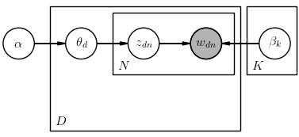
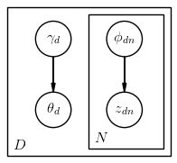

<style TYPE="text/css">
code.has-jax {font: inherit; font-size: 100%; background: inherit; border: inherit;}
</style>
<script type="text/x-mathjax-config">
MathJax.Hub.Config({
    tex2jax: {
        inlineMath: [['$','$'], ['\\(','\\)']],
        skipTags: ['script', 'noscript', 'style', 'textarea', 'pre'] // removed 'code' entry
    }
});
MathJax.Hub.Queue(function() {
    var all = MathJax.Hub.getAllJax(), i;
    for(i = 0; i < all.length; i += 1) {
        all[i].SourceElement().parentNode.className += ' has-jax';
    }
});
</script>
<script type="text/javascript" src="http://cdn.mathjax.org/mathjax/latest/MathJax.js?config=TeX-AMS-MML_HTMLorMML"></script>

# Getting Started

**LDA++** is a fast and easy-to-use C++ library, that allows users to experiment
with various LDA models. The purpose of this page is to help users become
acquainted with **LDA++**. Latent Dirichlet Allocation (LDA) [[1]](#lda) in regards
to natural language processing, to quote
[wikipedia](https://en.wikipedia.org/wiki/Latent_Dirichlet_allocation), is  is
a generative statistical model that allows sets of observations to be explained
by unobserved groups that explain why some parts of the data are similar. LDA
was initially presented as a graphical model for topic discovery by Blei,
Andrew Ng, and Michael I. Jordan in 2003. From 2003 onwards, a multitude of
variations of the original model was developed such as supervised LDA
[[2]](#slda) and Corr-LDA [[3]](#corrlda). **LDA++** implements many of the
existing LDA variations, as well as fsLDA [[4]](#fsLDA). In addition, among the
implemented algorithms, we include a set of new variations that aim to improve
existing models in terms of speed and reduce memory requirements.

## Notation and Terminology 

First of all, it is essential to make some claims about the parameters and
variables used in all LDA models in order to introduce a suitable notation. For
this reason, we will use the unsupervised LDA model, due to its simplicity, as
it was initially introduced by Blei et.al [[1]](#lda). Using [plate
notation](https://en.wikipedia.org/wiki/Plate_notation) we can illustrate the
dependencies among the variables concisely. The following image depicts the
probabilistic graphical model for unsupervised LDA.



Looking the figure from an overall perspective, it is clear that there are three
levels to the LDA representation. The parameters $\alpha_{K \times 1}$ and
$\beta_{K \times V}$ are corpus level parameters (model parameters), assumed to
be sampled once in the process of generating the corpus, while $\theta_{D
\times K}$ and $z_{D \times N \times K}$ are latent variables. $\theta$
corresponds to document-level variables, sampled once per document, whereas $z$
and $w$ are word-level variables, sampled once for each word in each document.

The key inferential problem that needs to be solved, in order to use LDA, is that
of computing the posterior distribution of the hidden variables given a
document:

\begin{equation}
    p \left( \theta, z \mid w, \alpha, \beta \right) = \frac{p\left( \theta, z,
    w \mid \alpha, \beta \right)}{p \left( w \mid \alpha, \beta \right)}
\end{equation}

However, although the posterior distribution is intractable to compute in
general, a wide variety of approximate inference algorithms can be considered
for LDA. The original paper used a [variational
Bayes](https://en.wikipedia.org/wiki/Variational_Bayesian_methods)
approximation of the posterior distribution [[1]](#lda), while alternative
inference techniques use Gibbs Sampling [[5]](#gibbs). At this point, it is
important to note that in **LDA++** the various LDA models are implemented by
using exclusively variational inference techniques and not Gibbs Sampling.

In case of unsupervised LDA, we use a fully factorized model as a variational
distribution $q(.)$, where Dirichlet parameter $\gamma_{D \times K}$ and the
multinomial $\phi_{D \times N \times K}$ are variational parameters. 
\begin{equation}
    q \left( \theta, z \mid \gamma, \phi \right) = q \left( \theta \mid \gamma
    \right) q \left( z \mid \phi \right)
\end{equation}
The following image depicts the graphical model representation of the
variational distributions used to approximate the posterior distribution in
LDA.



Variational inference provides us with a tractable lower bound, which can be
maximized with respect to $\alpha$ and $\beta$. Quoting Blei et.al in
[[1]](#lda), we can thus find approximate emprical Bayes estimates for LDA
model via alternating variational EM procedure that maximizes a lower bound
with respect to the variatonal parameters $\gamma$ and $\phi$, and then, for
fixed values of the variational parameters, maximizes the lower bound with
respect to the model parameters $\alpha$ and $\beta$. To sum up, we perform
variational inference for learning variational parameters in E-step while
perform parameter estimation in M-step. 

Using Jensens inequality to bound the log probability of a document, we
introduce the evidence lower bound (ELBO), which will be maximized in E-step. 
\begin{equation}\label{eq:elbo}
    \log p(w \mid \alpha, \beta) \geq \mathcal{L}(\gamma, \phi \mid
    \alpha, \beta) = E_q[\log p(\theta \mid \alpha)] + E_q[\log p(z \mid
    \theta)] + E_q[\log p(w \mid \beta, z)] + H(q)
\end{equation}

## Walkthrough

In this section, we provide a roadmap to the code implemented in **LDA++**. To
begin with, we introduce the concept of *Corpus* and *Document*. *Documents*
wrap the actual document that is used to apply LDA, while a *Corpus* is simply
a collection of *Documents*. Furthermore, we define two sets of *Parameters*,
*ModelParameters* and *VariationalParameters* that refer to model and
variational parameters respectively. Finally, there are also two interfaces
that implement E-step and M-step of variational EM.

### E-step Inteface

The E-step interface is very simple and implements merely two methods. The
first method, **doc_e_step** defines 

```cpp
/**
  * Interface that defines an E-step iteration for any LDA inference.
  *
  * The expectation step maximizes the likelihood (actually the Evidence Lower
  * Bound) of the data given constant parameters. In variational inference this
  * is achieved by changing the free variational parameters. In classical LDA
  * this step computes \f$\phi\f$ and \f$\gamma\f$ for every document given the
  * distribution over words for all topics, usually \f$\beta\f$ in literature.
  */
template <typename Scalar>
class IEStep : public EventDispatcherComposition
{
    typedef Matrix<Scalar, Dynamic, Dynamic> MatrixX;
    typedef Matrix<Scalar, Dynamic, 1> VectorX;
    
    public:

        /**
          * Maximize the ELBO.
          *
          * @param doc        A single document
          * @param parameters An instance of class Parameters, which
          *                   contains all necessary model parameters 
          *                   for e-step's implementation
          * @return           The variational parameters for the current
          *                   model, after e-step is completed
          */
        virtual std::shared_ptr<Parameters> doc_e_step(
            const std::shared_ptr<Document> doc,
            const std::shared_ptr<Parameters> parameters
        )=0;

        /**
         * Perform actions that should be performed once for each epoch for the
         * whole corpus. One use of this method is so that the e steps can know
         * which epoch they are running for.
         */
        virtual void e_step()=0;
};
```

```cpp
/**
 * Interface that defines an M-step iteration for any LDA inference.
 *
 * The maximization step maximizes the likelihood (actually the Evidence Lower
 * Bound) of the data by changing the parameters and using the variational
 * parameters as constants. In classical LDA this step computes the
 * distribution over words for all topics using the variational parameters
 * \f$\phi\f$ and \f$\gamma\f$.
 */
template <typename Scalar>
class IMStep : public EventDispatcherComposition
{
    typedef Matrix<Scalar, Dynamic, Dynamic> MatrixX;
    typedef Matrix<Scalar, Dynamic, 1> VectorX;
    
    public:

        /**
         * Maximize the ELBO.
         *
         * This function usually changes the passed in parameters.
         *
         * @param parameters Model parameters (maybe changed after call)
         */
        virtual void m_step(
            std::shared_ptr<Parameters> parameters
        )=0;

        /**
         * Perform calculations for a specific document.
         *
         * The variational parameters are only passed to the maximization step
         * in this method. In other implementations this method is usually
         * called *sufficient statistics*.
         *
         * This method allows for the implementation of online LDA inference
         * methods.
         *
         * @param doc          A single document
         * @param v_parameters The variational parameters computed in the e-step
         * @param m_parameters Model parameters could be changed in case of 
         *                     online methods
         */
        virtual void doc_m_step(
            const std::shared_ptr<Document> doc,
            const std::shared_ptr<Parameters> v_parameters,
            std::shared_ptr<Parameters> m_parameters
        )=0;
};
```
## References

<a name="lda"/>[[1] Blei, David M., Andrew Y. Ng, and Michael I. Jordan. "Latent dirichlet
allocation." Journal of machine Learning research 3.Jan (2003):
993-1022.](http://www.jmlr.org/papers/volume3/blei03a/blei03a.pdf)</a>

<a name="slda"/>[[2] Mcauliffe, J.D. and Blei, D.M., 2008. Supervised topic
models. In Advances in neural information processing systems (pp.
121-128).](https://www.cs.princeton.edu/~blei/papers/BleiMcAuliffe2007.pdf)</a>

<a name="corrlda"/> [[3] Blei, D.M. and Jordan, M.I., 2003, July. Modeling
annotated data. In Proceedings of the 26th annual international ACM SIGIR
conference on Research and development in informaion retrieval (pp. 127-134).
ACM.](http://www.cs.columbia.edu/~blei/papers/BleiJordan2003.pdf)</a>

<a name="fslda"/>[[4] Angelos Katharopoulos, Despoina Paschalidou, Christos Diou, Anastasios
Delopoulos. 2016. Fast Supervised LDA for Discovering Micro-Events in
Large-Scale Video Datasets. ACM International conference on Multimedia (MM
'16)](http://dx.doi.org/10.1145/2964284.2967237)</a>

<a name="gibbs"/> [[5] Griffiths, T.L. and Steyvers, M., 2004. Finding
scientific topics. Proceedings of the National academy of Sciences, 101(suppl
1),
pp.5228-5235.](http://www.cse.iitk.ac.in/users/piyush/courses/pml_winter16/lda_gibbs.pdf)</a>
