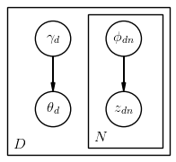

<style TYPE="text/css">
code.has-jax {font: inherit; font-size: 100%; background: inherit; border: inherit;}
</style>
<script type="text/x-mathjax-config">
MathJax.Hub.Config({
    tex2jax: {
        inlineMath: [['$','$'], ['\\(','\\)']],
        skipTags: ['script', 'noscript', 'style', 'textarea', 'pre'] // removed 'code' entry
    }
});
MathJax.Hub.Queue(function() {
    var all = MathJax.Hub.getAllJax(), i;
    for(i = 0; i < all.length; i += 1) {
        all[i].SourceElement().parentNode.className += ' has-jax';
    }
});
</script>
<script type="text/javascript" src="http://cdn.mathjax.org/mathjax/latest/MathJax.js?config=TeX-AMS-MML_HTMLorMML"></script>

# Parameters

In **LDA++** parameters are simply structs that correspond to either model or
variational parameters. One thing woth mentioning concerns the fact that
**LDA++** introduces different model and variational parameters according to
the trained model. For example, in case of model parameters there are two
different structs, one that corresponds to unsupervised LDA and another to
supervised LDA (sLDA).

## Model Parameters

In case of both unsupervised LDA and corr-LDA the model parameters are the two
corpus-level parameters, $\alpha_{K \times 1}$ and $\beta_{K \times V}$, which
are assumed to be sampled once in the process of generating the document.
To sum up, the basic *ModelParameters* struct constitutes of:

* $\alpha$ : the parameter of the Dirichlet prior on the per-document topic distributions $\theta$.
* $\beta$ : the parameter of the Dirichlet prior on the per-topic word distribution.

```cpp
/**
 * ModelParameters contain the basic LDA model parameters namely the prior for
 * the documents over topics distribution and the topics over words
 * distributions.
 */
template <typename Scalar>
struct ModelParameters : public Parameters
{
    ModelParameters() {}
    ModelParameters(
        Matrix<Scalar, Dynamic, 1> a,
        Matrix<Scalar, Dynamic, Dynamic> b
    ) : alpha(std::move(a)),
        beta(std::move(b))
    {}

    Matrix<Scalar, Dynamic, 1> alpha;
    Matrix<Scalar, Dynamic, Dynamic> beta;
};
```

However, in case of supervised LDA (sLDA), every document in the corpus belongs
to one of the $C$ discrete classes. Therefore, there is an extra model
parameter, $\eta_{K \times C}$. It can be easily seen that
*SupervisedModelParameters* are publicly inherited from *ModelParameters*,
which is the base struct for all model parameters. To sum up, the
*SupervisedModelParameters* struct constitutes of:


* $\alpha$ : the parameter of the Dirichlet prior on the per-document topic distributions $\theta$.
* $\beta$ : the parameter of the Dirichlet prior on the per-topic word distribution.
* $\eta$ : the logistic regression parameters.

```cpp
/**
 * SupervisedModelParameters adds the extra logistic regression parameters to model parameters.
 */
template <typename Scalar>
struct SupervisedModelParameters : public ModelParameters<Scalar>
{
    SupervisedModelParameters() {}
    SupervisedModelParameters(
        Matrix<Scalar, Dynamic, 1> a,
        Matrix<Scalar, Dynamic, Dynamic> b,
        Matrix<Scalar, Dynamic, Dynamic> e
    ) : ModelParameters<Scalar>(a, b),
        eta(std::move(e))
    {}

    Matrix<Scalar, Dynamic, Dynamic> eta;
};
```

## Variational Parameters

As we have already mentioned before, the inferential problem that needs to be
solved in order to use LDA is that of computing the posterior distribution of
the hidden variables given a document. However, due to the intractability of
the posterior distribution it is necessary to make use of an approximation
inference algorithm such as variational approximation. The overall approach is
based on a variational EM procedure. In variational E-step, the ELBO is being
maximized with respect to the variational parameters, while in the M-step, the
ELBO is being maximized with respect to the model parameters.

The two variational parameters in case of both supervised and vanilla LDA are
depicted in the following image and are the $\gamma_{D \times K}$ and $\phi_{D
\times N \times K}$. Thus, the struct that wraps the variational parameters
constitutes of:

* $\gamma$ : posterior Dirichlet parameters
* $\phi$ : posterior Multinomial parameters



```cpp
/**
 * The variational parameters are (duh) the variational parameters of the LDA
 * model.
 */
template <typename Scalar>
struct VariationalParameters : public Parameters
{
    VariationalParameters() {}
    VariationalParameters(
        Matrix<Scalar, Dynamic, 1> g,
        Matrix<Scalar, Dynamic, Dynamic> p
    ) : gamma(std::move(g)),
        phi(std::move(p))
    {}

    Matrix<Scalar, Dynamic, 1> gamma;
    Matrix<Scalar, Dynamic, Dynamic> phi;
};
```

However, in case of correspondence LDA (corr-LDA), as it is implemented in
*LDA++* there is an extra variational parameter, $\tau_{D \times N}$. The
graphical model representation of the variational distribution used to
approximate the posterior in corr-LDA, is depicted in the following image.
The variational parameters of corr-LDA constitute of:

* $\gamma$ : posterior Dirichlet parameters
* $\phi$ : posterior Multinomial parameters
* $\tau$ : N-dimensional Multinomial parameters


The *SupervisedCorrespondenceVariationalParameters* is the struct that wraps
the variational parameters of correspondence LDA and is publicly inherited from
*VariationalParameters*.

```cpp
/**
 * The supervised correspondence variational parameters add a variational
 * parameter for sampling a topic assignment to predict the class.
 */
template <typename Scalar>
struct SupervisedCorrespondenceVariationalParameters : public VariationalParameters<Scalar>
{
    SupervisedCorrespondenceVariationalParameters() {}
    SupervisedCorrespondenceVariationalParameters(
        Matrix<Scalar, Dynamic, 1> g,
        Matrix<Scalar, Dynamic, Dynamic> p,
        Matrix<Scalar, Dynamic, 1> t
    ) : VariationalParameters<Scalar>(g, p),
        tau(std::move(t))
    {}

    Matrix<Scalar, Dynamic, 1> tau;
};
```
